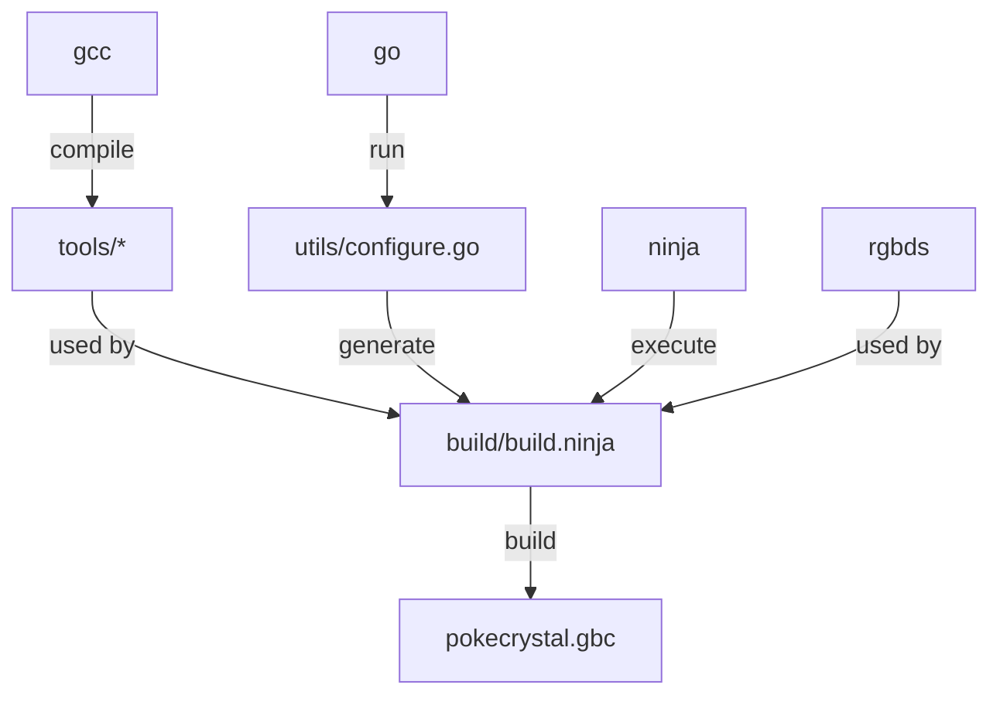

# Build Instructions

## Requirements

* `gcc`
* [ninja](https://ninja-build.org/)
* [rgbds](https://rgbds.gbdev.io/install) ~1.0.1
* [Go](https://go.dev/dl/) ≥ 1.10

The build roughly goes like this:



## Steps

### 1. Build `tools/`

```sh
pushd tools
ninja
popd
```

### 2. Generate the build directory

```sh
go run utils/configure.go
```

Or, if you're using `rgbenv`:

```sh
rgbenv exec go run utils/configure.go
```

### 3. Build the game

```sh
cd build
ninja
```

Note that you do not need to specify `rgbenv` when running `ninja`, as the RGBDS path
is already encoded in the generated build script.

Either way, the built game will be in `pokecrystal.gbc`, along with the `.sym` and
`.map` file.